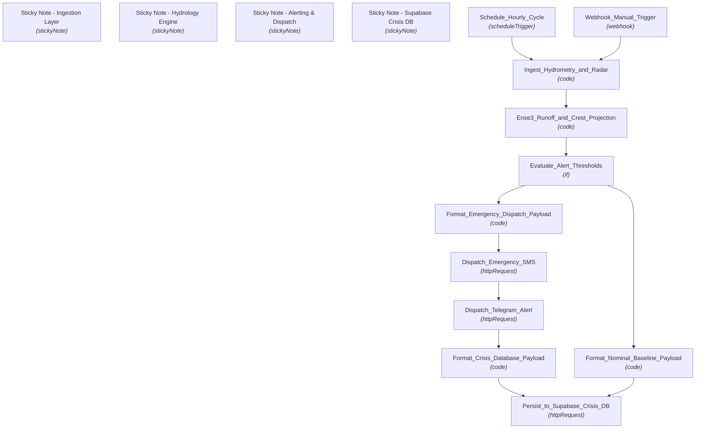

# 🚀 —E—n—v—i—r—o—n—m—e—n—t—a—l— —H—y—d—r—o—l—o—g—y— —&— —F—l—o—o—d— —W—a—r—n—i—n—g— —P—i—p—e—l—i—n—e— —(—G—r—e—n—o—b—l—e— —I—N—P— —E—n—s—e—3—)—

**An end-to-end, enterprise-grade n8n automation workflow.**

[-success?style=for-the-badge)](https://n8n.io/)

---

## 📌 Executive Summary

This n8n workflow provides a production-ready automation pipeline for **—E—n—v—i—r—o—n—m—e—n—t—a—l— —H—y—d—r—o—l—o—g—y— —&— —F—l—o—o—d— —W—a—r—n—i—n—g— —P—i—p—e—l—i—n—e— —(—G—r—e—n—o—b—l—e— —I—N—P— —E—n—s—e—3—)—**. It ingests incoming data, processes payloads through configured logic nodes, and routes insights/alerts across downstream channels.

---

## ⚡ Key Capabilities

* **🔄 End-to-End Automation:** Streamlines multi-step data processing and triggers actions automatically.
* **🧠 Intelligent Data Handling:** Integrates specialized nodes for data transformation, conditional evaluation, and API communication.
* **🚨 Real-Time Monitoring & Dispatch:** Ensures rapid incident response and data sync across connected systems.
* **📊 Scalable & Modular Architecture:** Built with n8n best practices for error handling, modularity, and high throughput.

---

## 📌 System Architecture & Process Flow

---

## 📂 Node Inventory & Pipeline Components

| # | Node Name | Type | Disabled |
|---|---|---|:---:|
| 1 | **Sticky Note - Ingestion Layer** | `stickyNote` | No |
| 2 | **Sticky Note - Hydrology Engine** | `stickyNote` | No |
| 3 | **Sticky Note - Alerting & Dispatch** | `stickyNote` | No |
| 4 | **Sticky Note - Supabase Crisis DB** | `stickyNote` | No |
| 5 | **Schedule_Hourly_Cycle** | `scheduleTrigger` | No |
| 6 | **Webhook_Manual_Trigger** | `webhook` | No |
| 7 | **Ingest_Hydrometry_and_Radar** | `code` | No |
| 8 | **Ense3_Runoff_and_Crest_Projection** | `code` | No |
| 9 | **Evaluate_Alert_Thresholds** | `if` | No |
| 10 | **Format_Emergency_Dispatch_Payload** | `code` | No |
| 11 | **Dispatch_Emergency_SMS** | `httpRequest` | No |
| 12 | **Dispatch_Telegram_Alert** | `httpRequest` | No |
| 13 | **Format_Crisis_Database_Payload** | `code` | No |
| 14 | **Format_Nominal_Baseline_Payload** | `code` | No |
| 15 | **Persist_to_Supabase_Crisis_DB** | `httpRequest` | No |

---

## ⚙️ Setup & Deployment Instructions

### 1. Import Workflow Blueprint
1. Download the [`workflow.json`](./workflow.json) file from this repository.
2. Open your **n8n instance**.
3. Click **Workflows** -> **Import from File**.
4. Select `workflow.json`.

### 2. Configure Credentials & Environment
* Set up required API tokens, webhooks, or database credentials for any integrated service nodes.
* Ensure relevant environment variables or global variables referenced in Code/HTTP nodes are populated in your n8n settings.

### 3. Activate Pipeline
* Toggle the workflow status to **Active** to begin live execution.

---

## 🤝 Contribution & Maintenance

Contributions, improvements, and bug fixes are welcome! Feel free to open an issue or submit a pull request.

---

## 📄 License

This project is licensed under the [MIT License](LICENSE).
